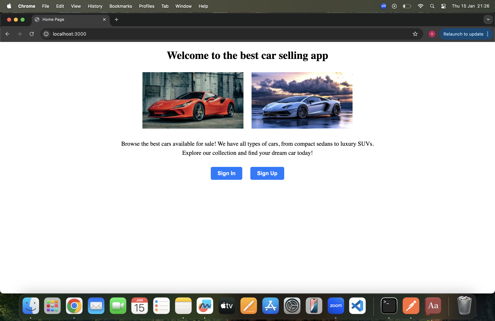

# Project 2 – MEN Stack CRUD App

## Description

This is a MEN Stack CRUD application built using MongoDB, Express, and Node.js.
The app allows users to create, view, update, and delete data using a clean MVC
architecture.

I built this project to practice full-stack JavaScript development, server-side
routing, and database integration.

## Technologies Used

- JavaScript
- Node.js
- Express
- MongoDB
- Mongoose
- EJS
- HTML
- CSS
- Git & GitHub

---

## Attributions

- Express Documentation: https://expressjs.com
- MongoDB Documentation: https://www.mongodb.com/docs/

---

## Next Steps

Planned future enhancements include:

- Improved UI styling
- Search and filtering functionality
- Mobile responsiveness
